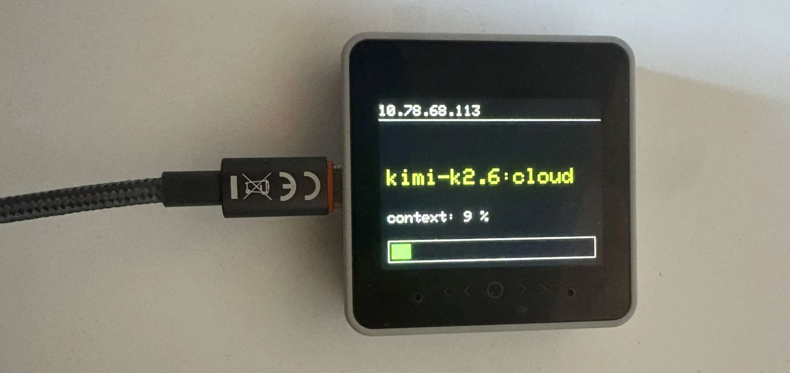

# WYCtx

A lightweight physical dashboard for the **M5Stack CoreS3 / CoreS3 SE**. Connects to Wi-Fi, exposes a tiny HTTP endpoint, and displays the current model name plus a colored progress bar on the built-in LCD.



## Hardware

- [M5Stack CoreS3 / CoreS3 SE](https://docs.m5stack.com/en/core/CoreS3) (ESP32-S3)

## Dependencies

| Library      | PlatformIO package               |
|--------------|----------------------------------|
| M5Unified    | `m5stack/M5Unified @ ^0.2.0`   |
| M5GFX        | bundled with M5Unified           |

## Installation

1. Install [PlatformIO Core](https://platformio.org/install/cli).
2. Edit `src/main.cpp` and set your Wi-Fi credentials:

```cpp
const char* ssid = "YOUR_SSID";
const char* password = "YOUR_PASSWORD";
```

3. Build and upload:

```sh
pio run --target upload
```

## Quick Start

Then ask Claude to generate a status line for you:

```
/statusline show model name and context percentage with a progress bar. Send the model and context values to http://<M5stack IP>/claude?model=<name>&context=<percentage>.
```

Claude generates the script, saves it into `.claude/`, and wires up settings for you. Done.

If Claude's generated script does not work, you can use the provided `statusline-commande.sh` instead. Copy it into your `.claude/` directory and edit the IP address to match your device.

**Requirements:** `curl`, `jq`

## Project structure

```
├── src/
│   └── main.cpp              # Application code
├── statusline-commande.sh    # Statusline script
├── platformio.ini            # Board & library config
└── README.md
```

## License

Do whatever you want with it.
